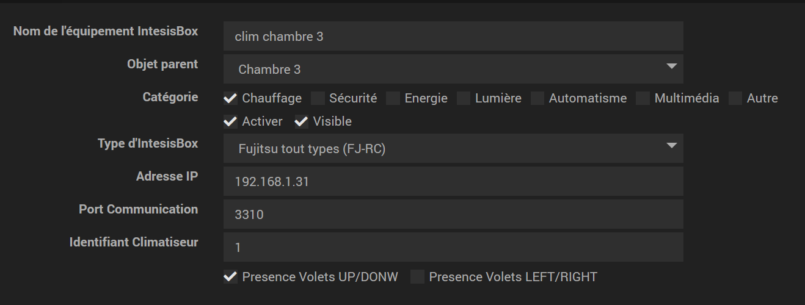
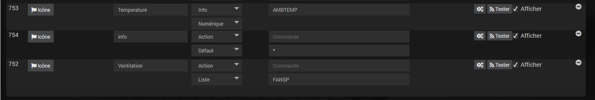

Description 
===

Plugin servant a l'intégration des boitiers IntesisBox WIFI a Jeedom.

__Ne fonctionne pas avec le modele IntesisHome__

Le modele IntesisBox Wifi est prévu pour recevoir des commandes ASCII et les retranscrit a un climatiseur/PAC/HVAC pour se subsituer a la telecommande filaire
ce dernier fonctionne en local et ne néscessite pas de connexion internet.

__Il est nescessaire de brancher le boitier sur le bus télécommande du bloc interne.__  
__Passer par un installateur pour le branchement est fortement recommandé.__  
__Bien couper l'alimentation élèctrique du circuit alimentant l'unité interne lors du raccordement.__  

Verifier la compatibilité sur https://www.intesisbox.com/en/wifi/gateways/
ainsi que le manuel pour la mise en place.

Certain boitiers peuvent nescessiter des connecteurs supplémentaires a acquerir en plus. Se renseigner aupres du constricteur de votre PAC/Climatiseur ou de votre installateur.

__Je n'assure pas de support sur les boitiers. je ne fait pas parti de l'entreprise__

Configuration du plugin
===

Installer et joindre le boitier à votre réseau.

__si possible privilégier une adresse IP fixe. Je ne rentre pas dans les détails, il existe suffisamment de tutoriels pour cela.__

Après téléchargement, il vous suffit d'activer celui-ci. il n'y a aucune configuration a ce niveau.

## Configuration de l'équipement.

La configuration/Ajout d'un equipement est accessible dans le menu plugin puis Confort et IntesisBox.

voici les paramètres disponibles : 

* Nom de l'équipement IntesisBox : nom de votre équipement IntesisBox,
* Objet parent : indique l'objet parent auquel appartient l'équipement,
* Catégorie : les catégories de l'équipement (il peut appartenir à plusieurs catégories).
* Activer : permet de rendre votre équipement actif,
* Visible : rend votre équipement visible sur le dashboard,
* Type d'IntesisBox : Certains boitiers ne prenent pas en charge toutes les commandes disponibles. Choisir le type de boitier mis en place.
* Adresse IP : Adresse IP du boitier.
* Port de communication (désactivé) : Le port par lequel Jeedom envoie les commandes au boitier. **Rempli lors de la sauvegarde et n'est pas modifiable.**
* Identifiant Climatiseur (désactivé) : Identifiant du climatisuer sur le bus télécommande. **Rempli lors de la sauvegarde et n'est pas modifiable.**
* Présence volets : **Désactivé. en cours de prise en charge** Permet de définir si on shouaite de créer les commandes et piloter les flux de ventilation.

## Commandes.

Les commandes sont crées lors de la sauvegarde du plugin. et actualisées a chaque sauvegarde.
Il est toutefois possible de rajouter des commandes si besoin.

voir [les specifications du boitier pour les commandes disponibles]( https://www.intesisbox.com/intesis/product/media/intesisbox_wmp_protocol_specs_en.pdf?v=2.2)

Exemple avec la commande d'actualisation globale :

Une actualisation du plugin a lieu a chaque sauvegarde.

chaque commande dispose de son retour d'état a chaque éxécution.

## Cron et interrogations regulières.

un cron est en cours de nise en place pour l'actualisation regulières.
pour l'instant ajouter la commande d'actualisation globale si on shouaite un retour d'etat régulier.

Bug et Contribution
===
En cas de bug avéré du plugin il est possible d'ouvrir une issue :

https://github.com/nooblenabot/jeedom-plugin-IntesisBoxWMP/issues